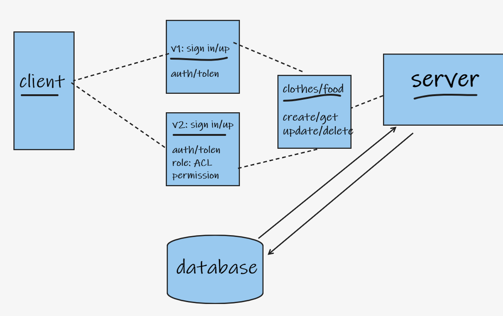

# auth-api

## description:
- A simple application to store clothes and food items, with authentication and authorization. You can sign up as an admin, an editor, a writer or a guest, token will be generated to keep sign in for the next time, and you'll get special permissions to according to your role to create, delete, update or get/read the items.

## features:
- base 64
- JWT
- ACL

## UML
- 
## HEROKU:
- https://omars-auth-api.herokuapp.com/  

## test: 
- **the testing units are working separately!! DON'T ONLY USE npm test**.
    - Unit Tests: `npm test v2` 
    - Unit Tests: `npm test v1` 
    - Unit Tests: `npm test auth-routs` 
